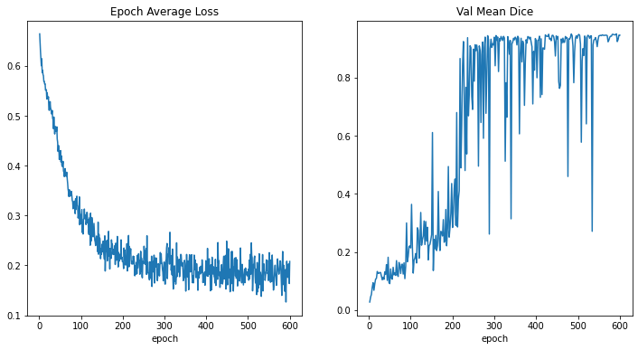
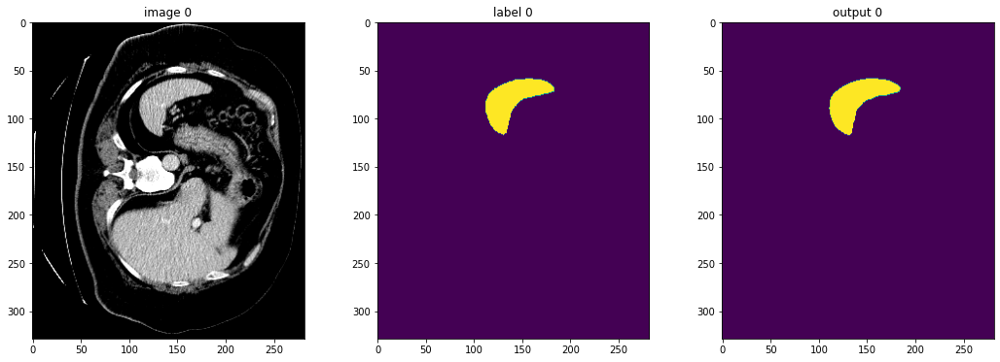
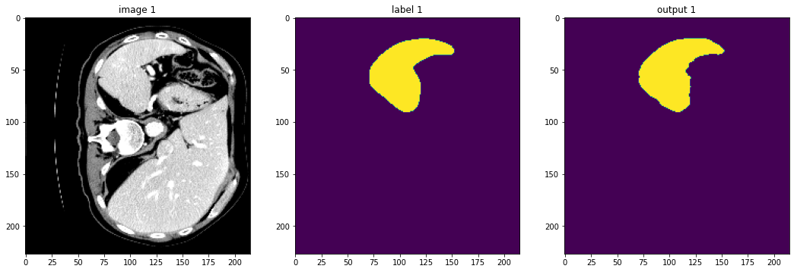

# GeNN

*GeNN* is a Generalizable Neural Network designed for semantic segmentation of lesions within medical imaging datasets. 
The neural network is designed and implemented with MONAI, a framework for deep learning in healthcare imaging. What makes MONAI special is the customization for network architecture and specifications, transformations for pre and post processing, high quality documentation and reproducibility for network verification.  

## Datasets

### Medical Segmentation Decathlon

**Brain tumour task**

The MSD Brain tumours task is subset of data taken from the Brain Tumour Image Segmentation (BraTS) dataset. It is comprised of 750 multiparametric magnetic resonance images (mp-MRI) of patients diagnosed with a highly malignant primary brain tumour named a glioblastoma or a low-grade glioma.  The MRI modalities used are T1-weighted (T1), post-contrast enhancement T1 using Gadolinium (T1-Gd), T2-weighted (T2) and a T2 Fluid Attenuated Inversion Recovery (Flair). 

Enhancing tumour is the first region of interest within the task, it is the cancerous part of the tumour responsible for breaking down the blood-brain-barrier, allowing the gadolinium-based contrast agent to enter the lesion which shows very prominent and bright within the T1-Gd modality. Necrosis is accident cell death caused by the cancerous brain tumour in high-grade gliomas and is best shown in the T1-Gd modality. The last region of interest is edema which is the swelling of the brain, in this case caused by the intracranial lesions mentioned above, it is best shown in the Flair modality. All scans for this task were resampled to 1mm3 voxel resolutions and skull stripped for optimal and consistent segmentations.

**Heart task**

The heart dataset is a consists of 30 MRI scans of the entire heart, where the task is to segment the left atrium. The scan contains a manually corrected segmentation of the left atrium appendage, mitral plane and portal vein endpoints. The voxel resolution of the image is 1.25 x 1.25 x 2.7mm3 due to the MRI compensating for heartbeat and respiration using single cardiac phasing. 

**Hippocampus task**

This task has 195 MRI scans of 90 healthy individuals and 105 scans of people with non-affective psychotic disorders. The goal being to segment the hippocampus into the anterior and posterior portions. The task was chosen because of its small scale in comparison to the large heterogenous foreground. 

**Liver task**

The liver task consists of 201 contract enhanced CT images, provided by many different institutions. The dataset consists of patients diagnosed with either a hepatocellular carcinoma or a metastatic lesion originating from breast, colorectal or lung. The liver scans have little prepossessing with slice thickness ranging from 0.45 to 6mm, which makes it difficult to segment the data efficiently and adds issues such as class imbalance since there is a large foreground of unclassifiable data. 

**Prostate task**

This task consists of 48 multiparametric MRI scans using 2 modalities. T2-weighted scans and an apparent diffusion coefficient (ADC) map. The regions of interest are prostate peripheral zone (PZ) and transition zone (TZ). 

**Lung task**

This task 96 CT scans comprising of patients with non-small cell lung cancer. The CTs were set to a section thickness of less than 1.5mm task specific settings can be set without losing any information. The regions of interest for this task are the lung body and the cancer. 

**Pancreas task**

Comprised of 420 portal venous CT scans to enhance the portal vein and hepatic vessels, including the pancreatic vessels. The regions of interest are the pancreatic parenchyma and the lesions, which were manually segmented. Scans are sliced at 2.5mm intervals allowing for simple slice indexing for the all scans in the network. 

**Hepatic Vessel task**

The second liver dataset is comprised of 443 portal venous CT scans of varying thickness and exposure times. The regions of interest for this task are the small heterogenous vessels and tumours in the liver. The changing exposure times and the large foreground makes the segmentation difficult due to the small nature of hepatic vessels. 

**Spleen task**

The spleen task is 61 portal venous CT scans comprised of patients with liver metastases taken from the hepatic vessels task, all spleens in the task are healthy as it is the region of interest. This task is difficult because of the large foreground. 

## Models 

Pretrained UNet models are provided, labeled as `best_metric_model-{task}-{epoch_count}.pth`. A sample pretrained model such as spleen is provided.

## Training

The model is a 3D UNet encoder-decoder CNN with 5 layers comprising of 16,32,64,128 and 256 channels. Each convolutional operation at each later is set to a stride of 2x2x2 and the network has a residual unit count of 2 with batch normalization. The model uses Dice Loss as a loss function and Dice Score as a metric for accuracy between ground truth and predicted image. It is trained for 600 epochs and validated at each epoch with a batch size of 4 to calculate dice score at each epoch. It was seen that the mean dice and average loss tapered at ~270 epochs, so further testing is needed to determine best epoch count for optimal performance and efficiency

## Results

The model shows that a progressive reduction of loss with an increase in mean dice score in validation testing, clearly demonstrating a correct amount of training data learning with no present signs of over fitting. 

**Spleen Dataset**

The spleen dataset achieves a best mean Dice Coefficient of 95.09% at the 592nd Epoch. Early stopping could have been beneifitial to prevent overfitting, but with such a small margin between 592 epochs and the set 600 becomes redundent in this specific training case.

`
best mean dice: 0.9509 at epoch: 592
`

This prediction is taken at slice 80 of a training image so that both the abdominal CT can be shown and the ground truth supplied with the dataset against the predicted image by the GeNN. THe first spleen prediction has a marginal difference to the ground truth due to transformation of the training image and clear boundaries within the CT that cause the foreground to be different density allowing for clearer segmentation of the region of interest. Prediction 2 however, has a larger overlap than prediction 1 due to the scaled intensity of the foreground being similar to the region of interest making it more difficult for feature extraction, however still performs extremely well. 

## Future Works

- [ ] Stroke and Ischemic lesion detection
- [ ] *dynUnet* to determine the optimal kernel sizes, strides and network depth from the training set.
- [ ] config file for generalization - out channels, batch size, num workers, slice depth, scale intensity, spatial size, spacings
- [ ] early stopping for over fitting prevention
- [ ] TensorBoard integration
- [ ] 

